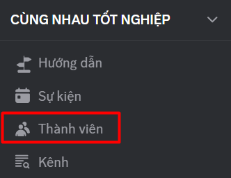

# Member Management

### How to Manage Members

1. In the left navigation bar, select **Members**.

<figure><figcaption></figcaption></figure>

2. Here, you can view the full list of members in your Clan.\
   Use the **search** function to quickly find a specific person.

<figure><figcaption></figcaption></figure>

3. When you right-click on a member’s name, you can:

* View the member’s profile.
* Send a private message to the member.
* Transfer Clan ownership.
* Remove the member from the Clan if necessary.

<figure><figcaption></figcaption></figure>

4. You can quickly assign roles to each member by clicking the “+” sign in the **Role** column:

<figure><figcaption></figcaption></figure>
