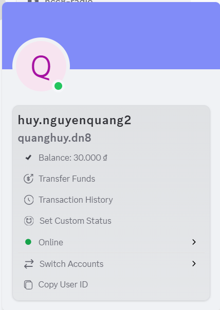

# Roles & Permissions Management

### **1. Permissions Management**

As your community grows, both the number of members and the level of interaction increase. Without proper control over permissions, issues such as message spam, deletion of important content, or unintended channel edits can occur. This not only disrupts order but also negatively affects the overall experience of the group.

#### **Available Permissions in the System**

<figure><figcaption></figcaption></figure>

* **Administrator** – Full control over the Clan and channel list (almost equivalent to the owner).
* **Manage Clan** – Manage Clan settings, roles, channels, and member activities.&#x20;


However, the **Manage Clan** permission <mark style="color:red;">**cannot view or manage the full channel list**</mark>, which distinguishes it from **Administrator**.


* **Manage Channel** – Create, edit, and delete channels.
* **Manage Thread** – Create, edit, and delete threads (including private threads).
* **Send Message** – Send messages in public channels (including threads/topics).
* **Delete Message** – Delete messages in public channels (including threads/topics).
* **View Channel** – View public channels.


**Distinguishing Clan Permissions**

1. **Owner**

* When a Clan is created, the creator is automatically the Owner.
* No one can kick the Owner; the Owner can only transfer ownership to another member.
* Holds the highest authority and can perform all actions.
* Has absolute administrative control, including managing members, roles, channels, and all Clan settings.

2. **Administrator**

* Authority is just below the Owner, with almost full control over the Clan.
* Can manage the channel list, roles, members, and most settings.
* Can kick other Administrators or regular members, but **cannot kick the Owner**.


#### **How to set Permissions**

1. In the left menu, select **Roles**.

2. Under **Default Permissions**, set the basic actions that all members in the Clan can perform.

.png>)

3. Choose the permissions you want to apply to everyone and click **Save Changes**.

.png>)


By default, all new members joining the Clan are assigned the **@everyone** role.\
For this role, it is recommended to enable only the minimum permissions, such as **View Channel** and **Send Message**, to ensure order and safety within the community.


### **2. Roles Management**

Not all members in a Clan need the same permissions. With **Roles**, you can create multiple roles with different permissions. You can also assign colors and icons to each group. This helps the Clan operate more professionally and makes management easier as your community grows.

#### **How to Create and Assign Roles**

1. In the left menu, select **Roles**.
2. Click **Create Role**, then edit the **name, color, and icon** under **Displays**.

<figure><figcaption></figcaption></figure>


**Maximum Role Icon Size**: 256 KB


3. Under **Manage Members**, click **Add Members** to assign members to the **Role**.


You can grant or revoke advanced permissions by creating a new role and assigning it to specific members (done in **Manage Members**).


<figure><figcaption></figcaption></figure>

4. In **Permissions**, customize what actions the role can perform (e.g., Admin, Send Message, Delete Message, etc.).

<figure><figcaption></figcaption></figure>

5. Click **Save Changes** to apply the role settings.
6. **Changing Role Display Order**

.png>)\
Simply drag and drop roles to arrange their display order. If a member has multiple roles, the display will follow this order.

### **3. Override Permissions**

**Override Permissions** allow you to set special permissions for **private channels** or **private threads**.

* When a channel/thread is created as private, only the **roles or users** who are directly added can see it.
* Within each private channel/thread, you can **customize detailed permissions** for each role or user:
  * Allow or deny viewing the channel.
  * Allow or deny sending messages.
  * Allow or deny managing threads, deleting messages, etc.

**How to Customize Permissions in a Private Channel/Thread:**

1. Click the **gear icon** on your private channel/thread.

<figure><figcaption></figcaption></figure>

2. Select **Permissions** from the left menu.

<figure><figcaption></figcaption></figure>

3. Customize the permissions for members in your channel.

<figure><figcaption></figcaption></figure>

4. Click **Save Changes** to apply.


This feature allows flexible management. For example, a regular member may only read content in a private channel, while a moderator can both read and send messages.

