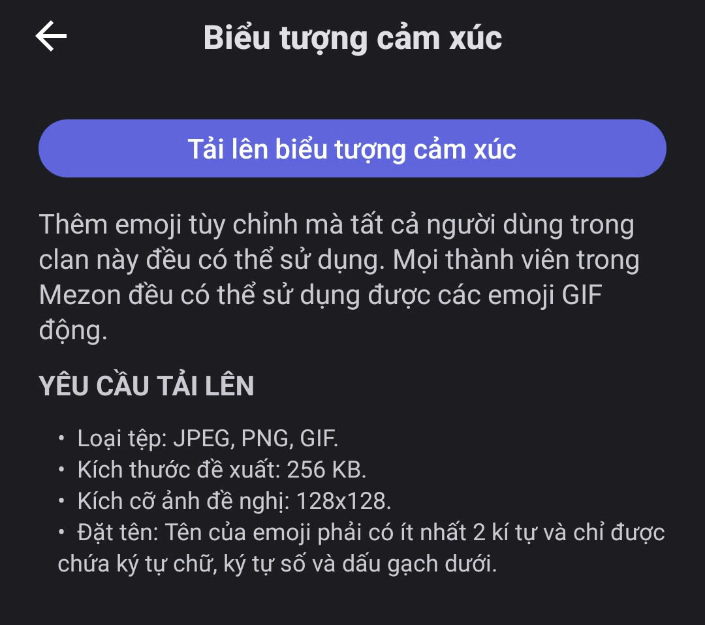
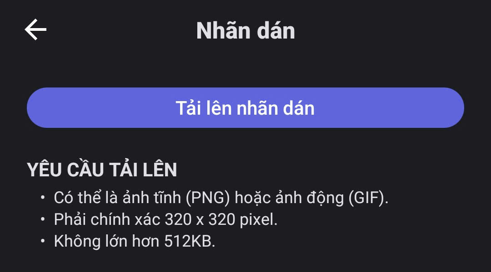
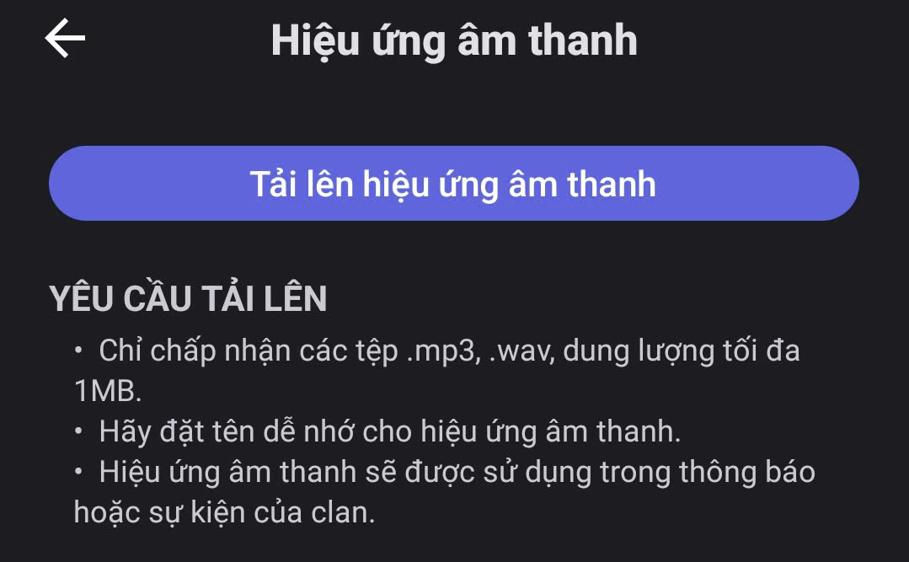
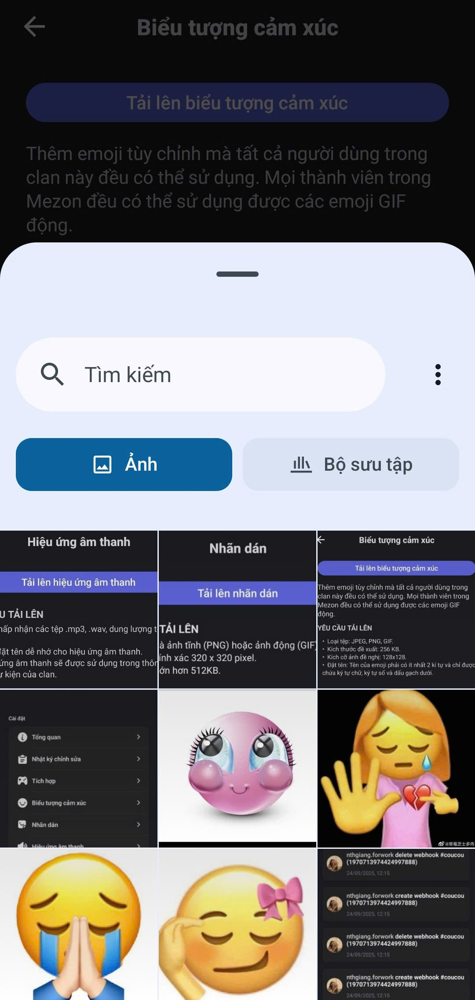
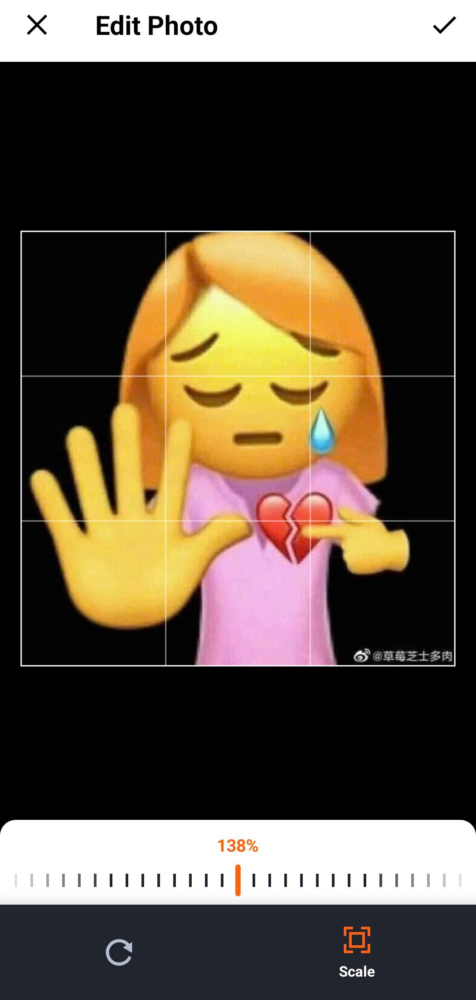
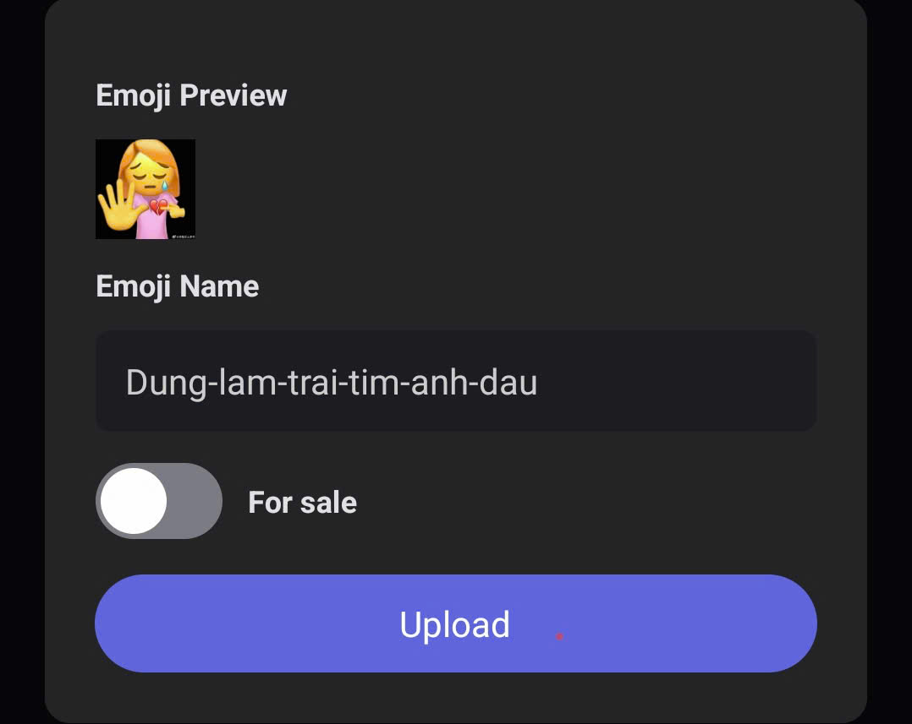

# Biểu tượng cảm xúc & Nhãn dán hình ảnh & Nhãn dán âm thanh

### **Cách thêm** Biểu tượng cảm xúc & Nhãn dán hình ảnh & Nhãn dán âm thanh 



Trong phần cài đặt tổng quan, lựa chọn Biểu tượng cảm xúc/ nhãn dán hình ảnh/ nhãn dán âm thanh theo nhu cầu của bạn

<figure><figcaption></figcaption></figure>




Nhấn **Tải lên** biểu tượng cảm xúc/ Tải lên nhãn dán hình ảnh/ Tải lên nhãn dán âm thanh

<figure><figcaption></figcaption></figure>

* Tối đa có thể tải lên 250 Biểu tượng cảm xúc mỗi Clan
* Loại tệp: JPEG, PNG, GIF
* Kích thước tệp tối đa: 256 KB
* Kích thước khuyến nghị: 128x128
* Đặt tên: Phải có ít nhất 2 ký tự và chỉ có thể chứa ký tự chữ và số cùng dấu gạch dưới

<figure><figcaption></figcaption></figure>

* Tối đa có thể tải lên 250 Nhãn dán hình ảnh mỗi Clan
* Loại tệp: PNG, APGN, GIF
* Kích thước tệp tối đa: 512 KB
* Kích thước khuyến nghị: 320x320
* Đặt tên: Phải có ít nhất 2 ký tự và chỉ có thể chứa ký tự chữ và số cùng dấu gạch dưới

<figure><figcaption></figcaption></figure>

* Tối đa có thể tải lên 250 Nhãn dán âm thanh mỗi Clan
* Loại tệp: MP3, WAV
* Kích thước tệp tối đa: 1 MB
* Đặt tên: Phải có ít nhất 2 ký tự và chỉ có thể chứa ký tự chữ và số cùng dấu gạch dưới



Chọn biểu tượng cảm xúc/ nhãn dán hình ảnh/ nhãn dán âm thanh mà bạn muốn tải lên

<figure><figcaption></figcaption></figure>




**Điều chỉnh kích thước và đặt tên** cho biểu tượng cảm xúc/ nhãn dán hình ảnh/ nhãn dán âm thanh. Nhấn **tải lên** để hoàn thành

<figure><figcaption></figcaption></figure>

<figure><figcaption></figcaption></figure>




> _Mỗi biểu tượng cảm xúc hay nhãn dán là một mảnh ghép của văn hóa nội bộ, giúp cộng đồng gắn bó và dễ dàng nhận diện. Thành viên có thể tự do đề xuất và thiết kế biểu tượng cảm xúc, khiến mọi cuộc trò chuyện thêm sinh động. Ngoài ra cũng có thể biểu đạt cảm xúc nhanh, ngắn gọn và hài hước - đúng với tinh thần “Chơi cùng nhau, làm việc cùng nhau” mà Mezon hướng tới._
