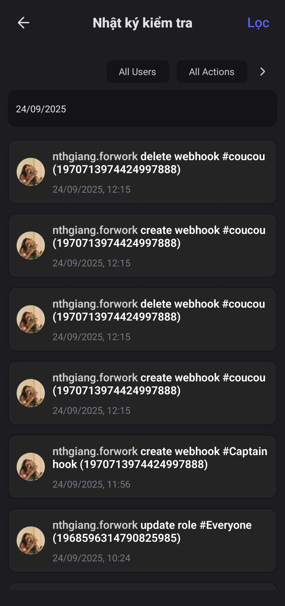

# Nhật ký kiểm tra

Là nơi lưu trữ những hoạt động quan trọng của Quản trị viên Clan. Khi Clan phát triển lớn mạnh và có nhiều hơn 1 Quản trị viên, Nhiệt ký kiểm tra là nơi tra cứu lịch sử hoạt động của Clan khi xảy ra sự cố/cần kiểm tra thông tin.

<figure><figcaption></figcaption></figure>

Nhật ký kiểm tra có nhiều bộ lọc để bạn có thể tra cứu dễ dàng:

* Theo thời gian
* Theo người gửi
* Theo hành động
