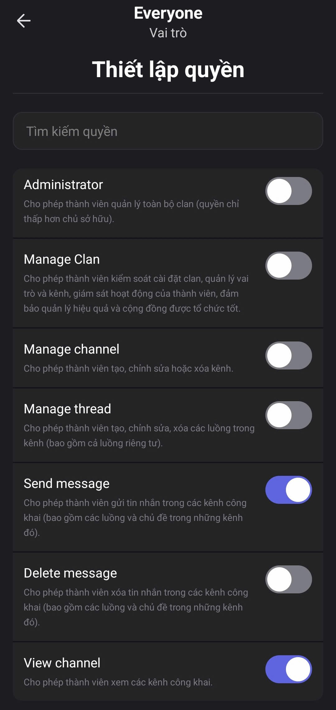
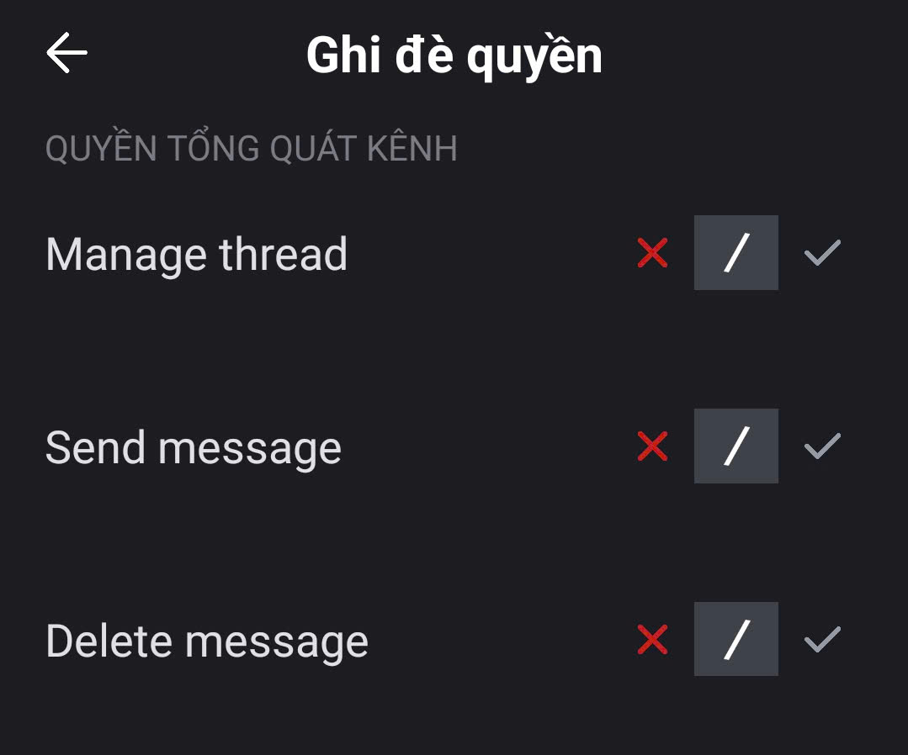

# Quản lý quyền hạn và vai trò

### 1. Quản lý quyền hạn

Khi cộng đồng phát triển, số lượng thành viên tham gia và mức độ tương tác ngày càng lớn. Nếu không kiểm soát được quyền hạn, rất dễ xảy ra tình trạng spam tin nhắn, xóa nội dung quan trọng hoặc chỉnh sửa kênh ngoài ý muốn. Điều này không chỉ gây mất trật tự mà còn ảnh hưởng đến trải nghiệm chung của cả nhóm.

#### 1.1. Các quyền hiện có trong hệ thống

<figure><figcaption></figcaption></figure>

* **Administrator** – Toàn quyền quản lý clan (quyền chỉ thấp hơn chủ sở hữu).
* **Manage Clan** – Cho phép thành viên kiểm soát cài đặt clan, quản lý vai trò và kênh, giám sát hoạt động của thành viên, đảm bảo quản lý hiệu quả và cộng đồng được tổ chức tốt


Tuy nhiên quyền **Manage Clan** <mark style="color:red;">**không nhìn thấy và không quản lý được toàn bộ danh sách kênh**</mark>, điểm này khác biệt so với Administrator.&#x20;


* **Manage Channel** – Cho phép tạo, chỉnh sửa hoặc xóa kênh
* **Manage Thread** – Cho phép tạo, chỉnh sửa, xóa các chủ đề trong kênh (bao gồm cả chủ đề riêng tư).
* **Send Message** – Cho phép gửi tin nhắn trong các kênh công khai (bao gồm các chủ đề và thảo luận ngắn trong những kênh đó)
* **Delete Message** – Cho phép xóa tin nhắn trong các kênh công khai (bao gồm các chủ đề và thảo luận ngắn trong những kênh đó)
* **View Channel** – Cho phép xem các kênh công khai.


### Phân biệt các quyền trong Clan

* **Chủ sở hữu**
  * Quyền hạn cao nhất, làm được tất cả mọi hành động.
  * Không ai có thể khai trừ chủ sở hữu. Chủ sở hữu chỉ có thể **chuyển quyền sở hữu** cho người khác.
  * Có quyền quản trị tuyệt đối, bao gồm quản lý thành viên, vai trò, kênh, và toàn bộ thiết lập của clan.
* **Quản trị viên**
  * Quyền hạn chỉ dưới chủ sở hữu, gần như toàn quyền quản lý clan.
  * Có thể quản lý danh sách kênh, vai trò, thành viên, và hầu hết các cài đặt.
  * Có thể khai trừ quản trị viên khác hoặc thành viên thường, **nhưng không thể khai trừ Chủ sở hữu.**


#### 1.2. Cách thiết lập quyền mặc định



Trong **Cài đặt Clan**, chọn mục **Vai trò**.



Chọn **@everyone** để thiết lập **quyền mặc định** áp dụng cho tất cả thành viên trong clan.

> Khi một người mới tham gia clan, họ sẽ tự động được gán vai trò **@everyone**.

<figure><figcaption></figcaption></figure>




Tại đây, bạn có thể bật hoặc tắt các hành động cơ bản mà mọi thành viên được phép thực hiện.

<figure><figcaption></figcaption></figure>


Khuyến nghị chỉ bật các quyền tối thiểu như **Xem kênh** và **Gửi tin nhắn** để đảm bảo trật tự và an toàn cho cộng đồng.




Sau khi hoàn tất, nhấn **Lưu thay đổi** để áp dụng quyền cho toàn bộ thành viên.



### 2. Quản lý vai trò&#x20;

Không phải tất cả thành viên trong Clan đều cần quyền hạn giống nhau. Với **Vai trò**, bạn có thể tạo nhiều vai trò khác nhau, gán màu sắc, biểu tượng riêng và thiết lập quyền chi tiết cho từng nhóm. Điều này giúp Clan vận hành chuyên nghiệp hơn, dễ dàng quản lý khi cộng đồng của bạn lớn dần.

#### **2.1. Cách tạo vai trò mới**



Trong **Cài đặt Clan**, chọn mục **Vai trò**.



Nhấn vào biểu tượng **“+”** để **tạo vai trò mới**.

<figure><figcaption></figcaption></figure>




Đặt **tên**, thiết lập **quyền hạn** và thêm thành viên cho vai trò đó.



Nhấn **Lưu** để hoàn tất.



#### 2.2. Quản lý vai trò đã tạo

* Vai trò mới sẽ xuất hiện trong **danh sách vai trò**.
* Chạm vào một vai trò để:
  * **Chỉnh hiển thị:** đổi tên, màu, biểu tượng.
  * **Chỉnh sửa quyền hạn:** bật/tắt các quyền như gửi tin nhắn, xóa tin, quản lý kênh...
  * **Quản lý thành viên:** thêm hoặc xóa thành viên khỏi vai trò.
  * **Xóa vai trò**: Khi vai trò không còn cần thiết, bạn có thể xóa vai trò để giữ danh sách gọn gàng.

<figure><figcaption></figcaption></figure>

### 3. Ghi đè quyền hạn

Ghi đè quyền hạn là cách thiết lập quyền đặc biệt cho **kênh riêng tư hoặc chủ đề riêng tư**.

* Khi một kênh/ chủ đề được tạo ở chế độ riêng tư, chỉ những người dùng có **vai trò** hoặc **người dùng** được thêm trực tiếp mới có thể thấy.
* Trong từng kênh/ chủ đề riêng tư, bạn có thể **tùy chỉnh chi tiết quyền** cho từng vai trò hoặc người dùng:
  * Cho phép hoặc chặn xem kênh.
  * Cho phép hoặc chặn gửi tin nhắn.
  * Cho phép hoặc chặn quản lý chủ đề, xóa tin nhắn…

#### **Cách tùy chỉnh chi tiết quyền trong kênh/ chủ đề riêng tư**

Để thiết lập quyền cho từng thành viên trong kênh hoặc chủ đề riêng tư, bạn có thể thực hiện như sau:



**Nhấn và giữ** vào kênh hoặc chủ đề riêng tư mà bạn muốn chỉnh sửa.



Chọn **Chỉnh sửa kênh**.



Vào mục **Quyền hạn kênh**.



Tại đây, bạn sẽ thấy hai phần:

* **Cơ bản:** Cho phép thêm thành viên hoặc vai trò vào kênh/ chủ đề riêng tư
* **Nâng cao:** Hiển thị danh sách thành viên trong kênh hoặc chủ đề. Bạn có thể chọn từng người để tùy chỉnh quyền chi tiết cho họ.

<figure><figcaption></figcaption></figure>




Sau khi hoàn tất, **nhấn Lưu thay đổi** để áp dụng các thiết lập.




Tính năng này giúp bạn quản lý linh hoạt: ví dụ một thành viên bình thường có thể chỉ đọc nội dung trong kênh riêng tư, còn quản trị viên phụ có thể vừa đọc vừa gửi tin nhắn.\


