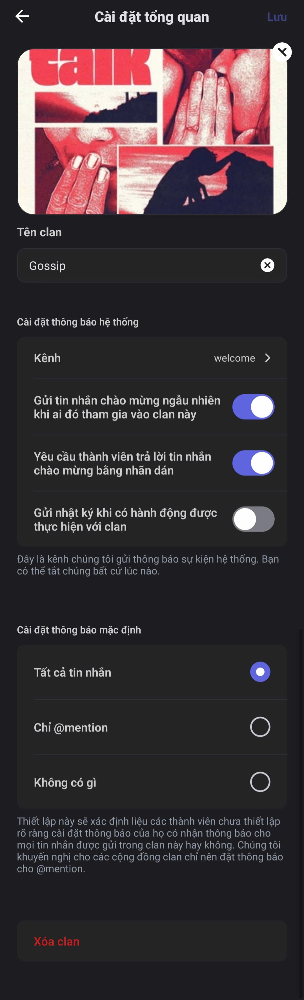

# Tổng quan

<figure><figcaption></figcaption></figure>

Trong phần này bạn có thể:&#x20;

* **Đổi tên Clan**: Tên Clan phải không được trùng với Clan khác đã tồn tại.
* **Đổi ảnh bìa**: Ảnh bìa sẽ được hiển thị ở ngay dưới tên Clan, có kích thước tối thiểu 960x540, và hiển thị đẹp nhất ở tỉ lệ 16:9. Giới hạn dung lượng tối đa là 10MB.
* **Chọn kênh mặc định** để nhận tin nhắn hệ thống và tùy chỉnh tin nhắn tự động.&#x20;
* **Cài đặt thông báo mặc định**
* **Xóa Clan**

