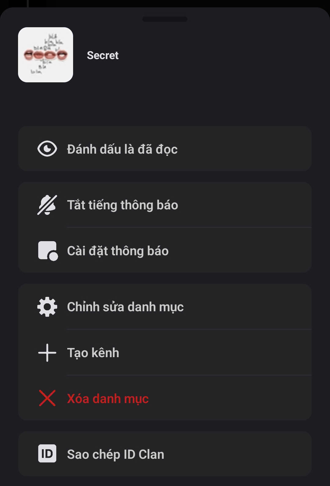

# Danh mục trong Clan

### Cách tạo Danh mục



Nhấn vào tên Clan của bạn sau đó chọn **Tạo danh mục.** Đảm bảo rằng bạn đã bật **Hiển thị danh mục trống**

<figure><figcaption></figcaption></figure>




Nhập **Tên danh mục** bạn muốn và nhấn Tạo

<figure><figcaption></figcaption></figure>




Danh mục mới sẽ xuất hiện ở trong phần **Điều hướng Clan**

<figure><figcaption></figcaption></figure>




> Danh mục giúp giảm bớt sự rối loạn thông tin, tiết kiệm thời gian tìm kiếm, và đảm bảo mọi người đều dễ dàng theo dõi đúng nội dung mình quan tâm. Với danh mục, không gian làm việc và cộng đồng trên Mezon luôn trực quan, ngăn nắp và dễ quản lý - dù tổ chức của bạn có hàng chục hay hàng trăm kênh.

### Cách quản lý Danh mục

Để quản lý một **Danh mục**, hãy **nhấn và giữ** vào danh mục bạn muốn thao tác.

<figure><figcaption></figcaption></figure>

Tại đây, bạn có thể dễ dàng thực hiện các hành động sau:

* **Đánh dấu là đã đọc** – xóa thông báo chưa đọc của toàn bộ kênh trong danh mục.
* **Tắt tiếng thông báo** – ngừng nhận thông báo từ các kênh thuộc danh mục này.
* **Cài đặt thông báo** – tùy chỉnh cách nhận thông báo theo ý bạn.
* **Chỉnh sửa danh mục** – thay đổi tên danh mục.
* **Tạo kênh mới** – thêm kênh văn bản, thoại hoặc phát trực tiếp vào danh mục.
* **Xóa danh mục** – loại bỏ danh mục cùng các kênh bên trong.
* **Sao chép ID Clan** – sao chép mã định danh để sử dụng cho mục đích kỹ thuật hoặc quản trị.


_Giúp bạn quản lý cấu trúc Clan một cách nhanh chóng và trực quan ngay trên giao diện di động._

