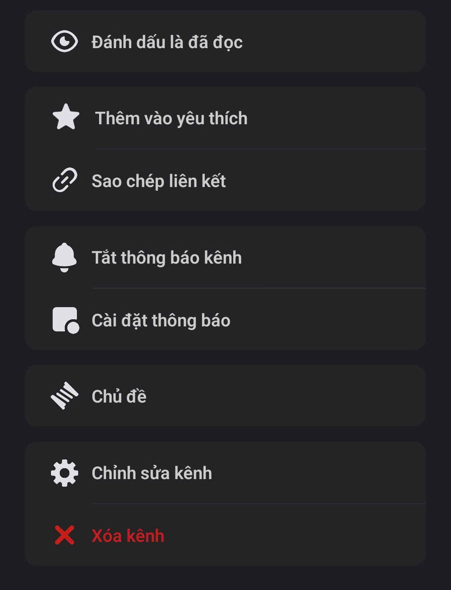

# Kênh trong Clan

### Cách tạo Kênh

* Nhấn giữ vào **Danh mục** mà bạn muốn tạo Kênh.
* Chọn **"Tạo kênh"**
* Có **3 loại Kênh**, mỗi loại phục vụ một mục đích riêng:

<figure><figcaption></figcaption></figure>

1. [**Kênh Văn bản**](kenh-van-ban/): Là nơi giao tiếp chính của Clan. Bạn có thể gửi tin nhắn văn bản, hình ảnh, video, cùng những tính năng lưu trữ thông tin quan trọng khác.
2. [**Kênh Thoại**](kenh-thoai.md): Nơi trò chuyện bằng giọng nói, chia sẻ màn hình hoặc gọi video. Tất cả đều miễn phí, không giới hạn thời gian và độ phân giải!
3. [**Kênh Phát trực tiếp**](kenh-phat-truc-tiep.md): Nơi chủ Clan tổ chức buổi phát sóng, talkshow hay podcast định kỳ.

> Khi tạo Kênh, bạn có thể bật chế độ **Kênh riêng tư** để chỉ những thành viên được chọn mới nhìn thấy.


Mỗi Clan có thể chứa tối đa 500 Kênh trong cùng 1 thời điểm.


### Cài đặt Kênh

Bạn có thể truy cập **cài đặt kênh** bằng cách nhấn vào **tên kênh** mà bạn muốn tùy chỉnh.

<figure><figcaption></figcaption></figure>

Tại đây, bạn có thể thực hiện các thao tác sau:

* Đánh dấu là đã đọc _(chỉ áp dụng cho kênh văn bản)_
* Thêm vào yêu thích để truy cập nhanh hơn
* Sao chép liên kết kênh
* Tắt thông báo cho kênh
* Tùy chỉnh cài đặt thông báo chi tiết hơn
* Quản lý chủ đề _(chỉ dành cho kênh văn bản)_ [\[Tìm hiểu Chủ đề là gì?\]](kenh-van-ban/chu-de.md)
* Chỉnh sửa thông tin kênh
* Xóa kênh khi không còn cần thiết

#### Chỉnh sửa kênh

1. **Tên và Mô tả kênh**

* Tên kênh: Thay đổi tên của kênh đó.
* Mô tả của kênh: mô tả cách thành viên nên sử dụng kênh này (Tối đa 1024 kí tự).

2. **Danh mục**

<figure><figcaption></figcaption></figure>

* Là nơi để bạn thay đổi danh mục mà Kênh đó thuộc về. Bạn cũng có thể sử dụng cách kéo thả tên Kênh ở vùng điều hướng Clan để thay đổi danh mục cho Kênh.

3. **Quyền hạn kênh**

<figure><figcaption></figcaption></figure>

* Là nơi để thay đổi quyền hạn những ai được xem kênh.&#x20;
* Mặc định, quyền hạn Kênh sẽ được đồng bộ với quyền hạn của Danh mục mà kênh đó thuộc về.
* Bật Kênh riêng tư để có thể tùy chỉnh về quyền hạn với chính xác Kênh đó.


Phần quyền hạn chỉ có ở Kênh văn bản và Kênh thoại. Kênh phát trực tiếp luôn ở chế độ công khai cho tất cả các thành viên của Clan được tham gia.


4. **Tác vụ nhanh**

<figure><figcaption></figcaption></figure>

* **Thêm tin nhắn nhanh**:Tính năng này cho phép bạn gửi những câu chào, thông báo hoặc phản hồi định sẵn chỉ bằng một lệnh ngắn.

1. Nhập **từ khóa** để kích hoạt tin nhắn (ví dụ: "_xin chào"_).
2. Nhập **nội dung tin nhắn** bạn muốn gửi (ví dụ: _“Chào buổi sáng, chúc bạn có một ngày mới tốt lành!”_).
3. Sau khi lưu, khi bạn gõ **`/xin chào`**, hệ thống sẽ tự động hiển thị tin nhắn bạn đã cài đặt.


_Mẹo:_ Bạn có thể tạo nhiều tin nhắn nhanh khác nhau cho các tình huống thường dùng như lời chào, phản hồi tự động hoặc thông báo nội bộ.


* **Thêm menu nhanh**: Menu nhanh giúp bạn kích hoạt các hành động của **Bot** chỉ bằng một cú nhấp.

1. Nhập **tên menu** mà bạn muốn tạo.
2.  **Kích hoạt sự kiện Bot** – Menu nhanh này sẽ tự động chạy một sự kiện Bot khi được chọn.

    > Lưu ý: Bạn cần **thêm và áp dụng Bot** trước khi có thể dùng tính năng này.
3. Sau khi tạo, **nhấn chuột phải vào tin nhắn**, chọn **Menu nhanh** và chọn hành động tương ứng để Bot thực hiện.


_Tham khảo thêm:_ Xem hướng dẫn chi tiết về cách cài đặt và áp dụng Bot tại mục **\[**[**Dành cho lập trình viên**](https://mezon.ai/developers/applications)**]**.



Phần cài đặt Menu nhanh chỉ có ở Kênh văn bản và Kênh thoại.


5. **Tích hợp**

<figure><figcaption></figcaption></figure>

* Tạo và cài đặt Webhook riêng cho Kênh
* Tham khảo [**Dành cho lập trình viên**](https://mezon.ai/docs/mezon-sdk-docs/) để biết thêm về Mezon Webhook & SDK

6. **Xóa kênh**

Trong trường hợp Kênh không còn được sử dụng hoặc bạn muốn dừng hoạt động Kênh, bạn có thể xóa vĩnh viễn Kênh.


#### _<mark style="color:red;">**Lưu ý**</mark>**: hành động này không thể hoàn tác và toàn bộ dữ liệu và nội dung trong Kênh sẽ bị xóa theo.**_

