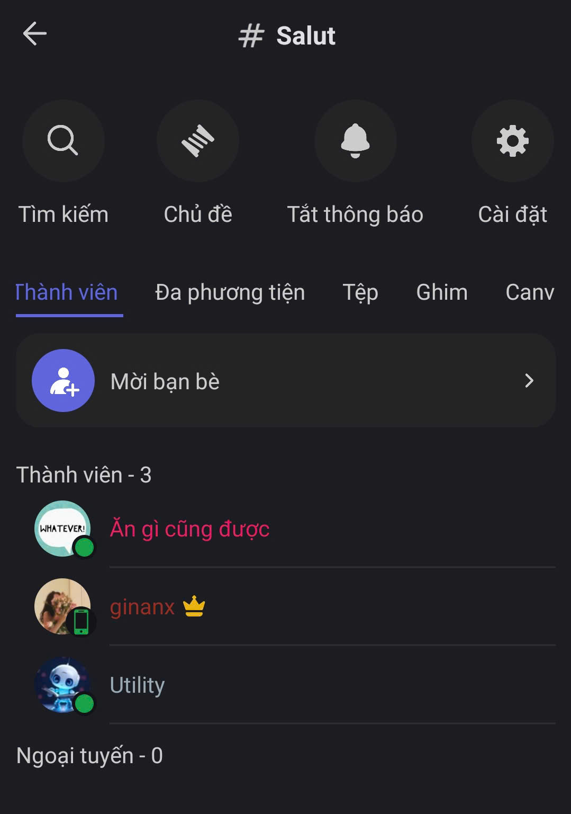

# Kênh Văn bản

<figure><figcaption></figcaption></figure>

Trong **Kênh Văn bản**, bạn có thể khám phá các tính năng chính sau:

* [**Chủ đề**](chu-de.md)**:** Tách chủ đề riêng để thảo luận rõ ràng hơn.
* [**Thảo luận ngắn**](thao-luan-ngan.md)**:** Tách cuộc thảo luận riêng ngay từ tin nhắn, giúp hội thoại chính gọn gàng và tập trung hơn.
* [**Tìm kiếm**](tim-kiem.md)**:** Tìm lại tin nhắn, file, hoặc người gửi nhanh chóng.
* [**Cài đặt thông báo**](cai-dat-thong-bao.md)**:** Tùy chỉnh cách nhận thông báo cho từng kênh.
* [**Thành viên**](thanh-vien.md)**:** Xem danh sách và trạng thái hoạt động của thành viên.
* [**Đa phương tiện**](da-phuong-tien.md)**:** Xem toàn bộ hình ảnh đã chia sẻ trong kênh.
* [**Tệp tin**](tep-tin.md)**:** Quản lý tất cả tệp đã gửi trong cuộc trò chuyện.
* [**Ghim**](ghim.md)**:** Ghim những tin nhắn quan trọng để dễ truy cập.
* [**Bảng ghi chú**](bang-ghi-chu.md)**:** Tạo và quản lý tài liệu, ghi chú trong từng kênh.
* [**Tùy chọn tương tác**](../../../../../../tai-khoan-and-ca-nhan-hoa/phim-tat.md): Tùy chỉnh cách bạn tương tác với tin nhắn: tắt/ bật chế độ ẩn danh, Buzz.
