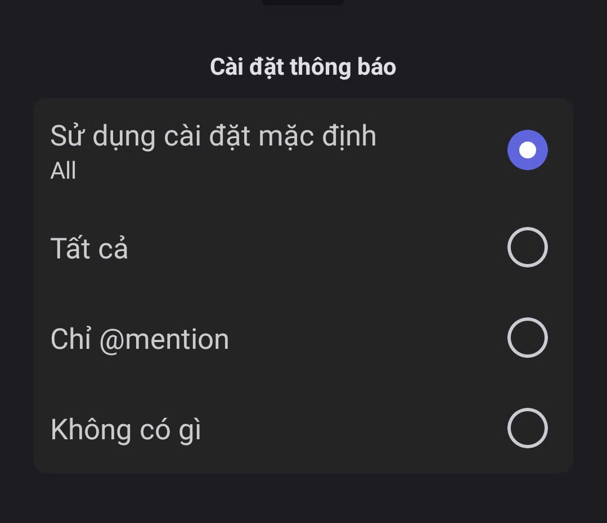
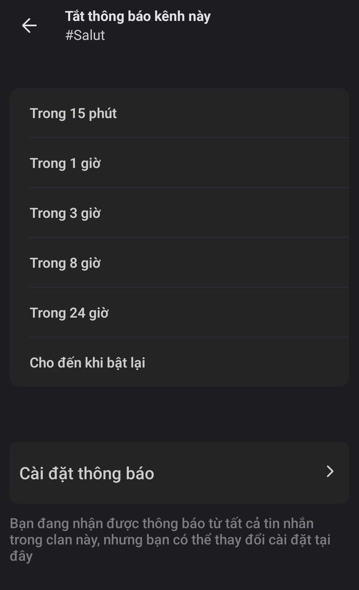

# Cài đặt thông báo

Bạn có thể nhanh chóng tùy chỉnh thông báo của Channel, giúp bạn không bị làm phiền bởi những thông báo không quan trọng

<figure><figcaption></figcaption></figure> <figure><figcaption></figcaption></figure>

1. **Tắt thông báo kênh:** Tắt hoàn toàn thông bào từ Kênh trong khoảng thời gian bạn muốn, trong 1 khoảng thời gian như 15 phút, 1 tiếng,... hay cho đến khi bạn quyết định mở lại.
2. **Sử dụng cài đặt mặc định:** Sử dụng cùng cài đặt thông báo mà bạn đã chọn với Danh mục của Kênh đó.
3. **Tất cả:** Nhận tất cả thông báo.
4. **Chỉ @mention**: Chỉ thông báo khi ai đó nhắc đến bạn.
5. **Không có gì:** Tắt thông báo hoàn toàn.


Nếu tham gia nhiều Kênh, hãy để hầu hết ở chế độ **Chỉ @mention**, như vậy bạn vừa không bỏ lỡ điều quan trọng, vừa không bị “ting ting” suốt ngày.

