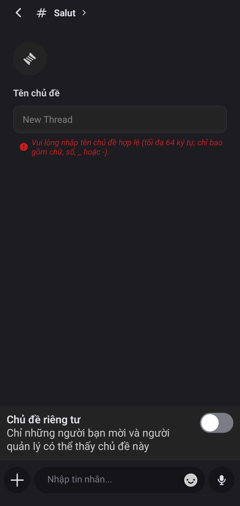

# Chủ đề

### **Cách tạo Chủ đề**



Mở Mezon, chọn **Kênh Văn bản** bạn cần trao đổi.



Nhấp vào **biểu tượng cuộn chỉ**  trong thanh menu, hoặc ngay trên thanh nhập tin nhắn

<figure><figcaption></figcaption></figure>

<figure><figcaption></figcaption></figure>




Chọn **Tạo chủ đề** để bắt đầu một Chủ đề mới



Nhập **tên chủ đề** và gửi **tin nhắn đầu tiên** để bắt đầu thảo luận với nhóm.

<figure><figcaption></figcaption></figure>





Khi chọn **Chủ đề riêng tư** chỉ có bạn và những người được mời mới có thể thấy

