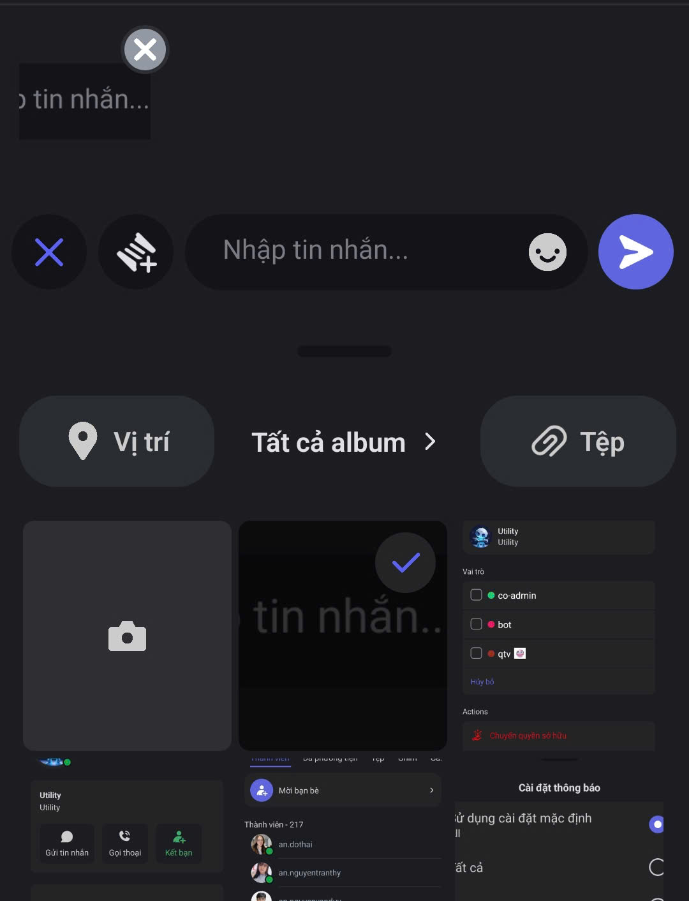
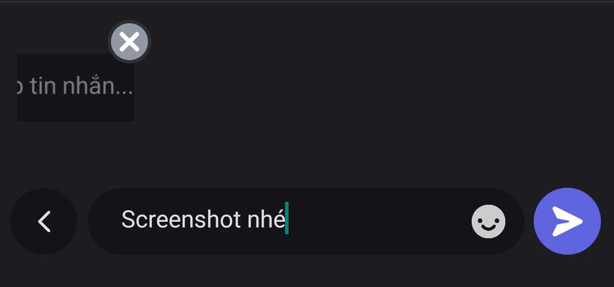
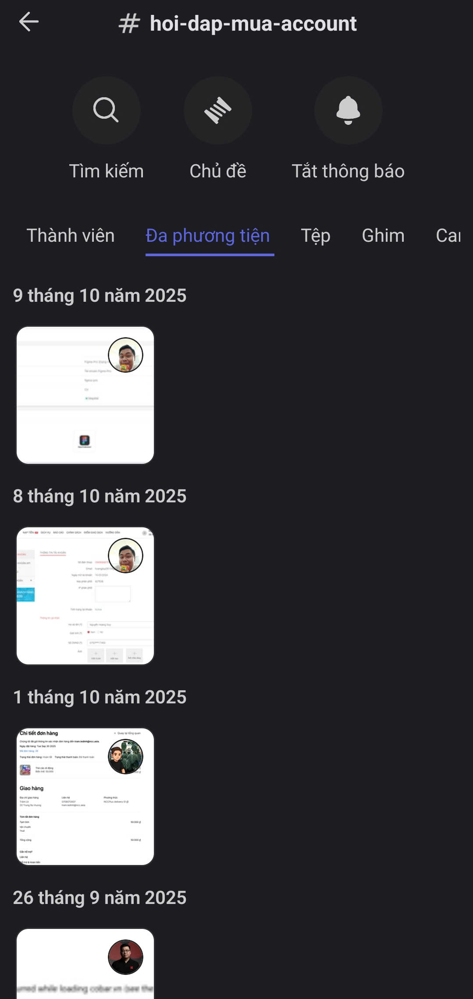

# Đa phương tiện

### Cách gửi ảnh



Mở **Kênh Văn bản** hoặc **Chủ đề** bạn cần trao đổi&#x20;



Nhấn vào **dấu cộng (+)** bên trái ô nhập tin nhắn.

<figure><figcaption></figcaption></figure>



Chọn ảnh cần gửi

<figure><figcaption></figcaption></figure>




Thêm **mô tả** nếu cần, hoặc nhấn **mũi tên** để gửi ngay

<figure><figcaption></figcaption></figure>




### Cách xem ảnh



Trong **Kênh Văn bản** hoặc **Chủ đề**, nhấn vào chọn **Đa phương tiện** ở menu.

<figure><figcaption></figcaption></figure>




Trong phần **Đa phương tiện**, tất cả hình ảnh từ Kênh Văn bản hoặc Chủ đề được sắp xếp theo từng ngày, giúp bạn dễ dàng xem lại và tìm kiếm nội dung mong muốn.

<figure><figcaption></figcaption></figure>



