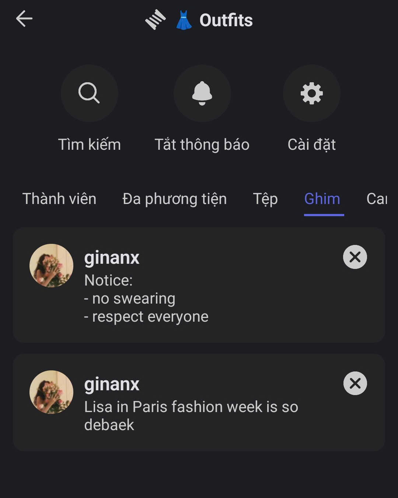

# Ghim

### Cách ghim tin nhắn



Trong **Kênh Văn bản/ Chủ đề**, nhấn và giữ vào tin nhắn bạn muốn ghim.

<figure><figcaption></figcaption></figure>




Chọn Ghim tin nhắn, xác nhận lại và nhấn **“Có”.**

<figure><figcaption></figcaption></figure>




### Cách xem tin nhắn đã ghim



Trong **Kênh Văn bản** hoặc **Chủ đề**, nhấn vào chọn **Ghim** ở menu.

<figure><figcaption></figcaption></figure>



Nhấn vào **tin nhắn đã ghim** để chuyển đến vị trí gốc của nó.



Chọn **dấu X** nếu bạn muốn **bỏ ghim hoặc xóa tin nhắn khỏi danh sách ghim**.


