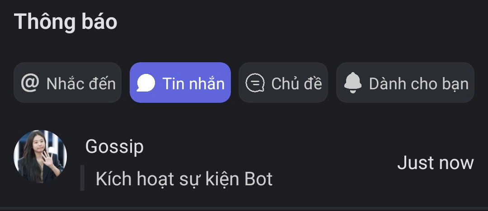

# Hộp thư

### Cách xem Hộp thư



Truy cập **thanh điều hướng dưới cùng**, chọn biểu tượng **🔔 Hộp thư**.

<figure><figcaption></figcaption></figure>



Tại đây, bạn có thể xem toàn bộ hoạt động liên quan đến mình trong Clan.

*   **@ Nhắc đến:** Hiển thị các tin nhắn mà bạn được tag trực tiếp.&#x20;

    <figure><figcaption></figcaption></figure>

* Vào mục **Tin nhắn** để xem tin nhắn bạn đã thêm, hoặc các tin nhắn quan trọng từ Clan .png>)
*   Vào mục **Chủ đề** để truy cập các **Thảo luận ngắn** trong từng Clan khác nhau

    <figure><figcaption></figcaption></figure>

*   **Dành cho bạn:** Bao gồm thông báo khi có **lời mời kết bạn** và **Mezon Đồng** được gửi đến&#x20;

    <figure><figcaption></figcaption></figure>



### Cách thêm tin nhắn vào Hộp thư



Nhấn và giữ vào **tin nhắn** mà bạn muốn lưu.



Chọn **Đánh dấu tin nhắn**.

<figure><figcaption></figcaption></figure>



Tin nhắn đó sẽ được thêm vào mục **Tin nhắn** trong **Hộp thư**, giúp bạn dễ dàng xem lại bất cứ lúc nào.

<figure><figcaption></figcaption></figure>


