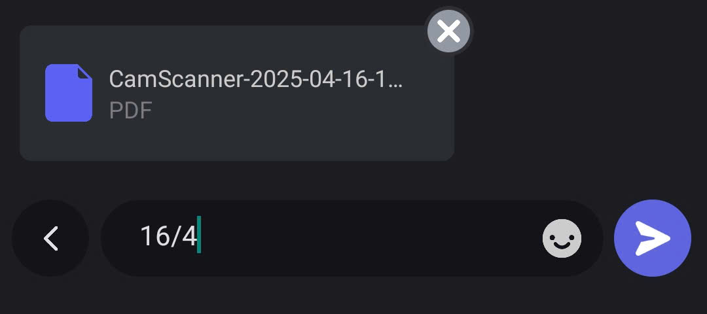
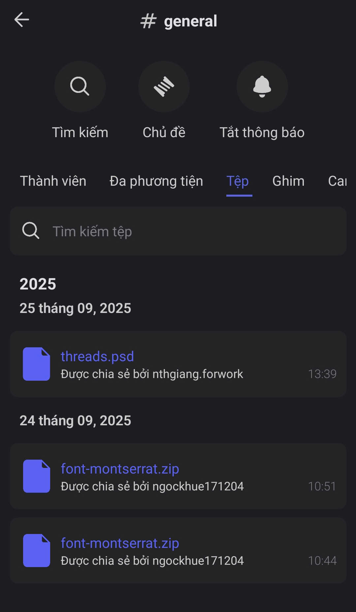

# Tệp tin

### Cách gửi tệp



Mở **Kênh Văn bản** hoặc **Chủ đề** bạn cần trao đổi&#x20;



Nhấn vào **dấu cộng (+)** bên trái ô nhập tin nhắn.

<figure><figcaption></figcaption></figure>




Chọn **Tệp**  trong menu

<figure><figcaption></figcaption></figure>




Chọn tệp tin mà bạn muốn gửi. Nhập mô tả (nếu cần) và ấn gửi ngay.

<figure><figcaption></figcaption></figure>




### Cách xem tệp tin



Trong **Kênh Văn bản** hoặc **Chủ đề**, nhấn vào chọn **Đa phương tiện** ở menu.

<figure><figcaption></figcaption></figure>




**Danh sách tệp** sẽ hiển thị kèm theo tên người gửi và thời gian gửi.&#x20;

<figure><figcaption></figcaption></figure>




Nhấn vào tệp để **Tải xuống và xem** trên điện thoại.


