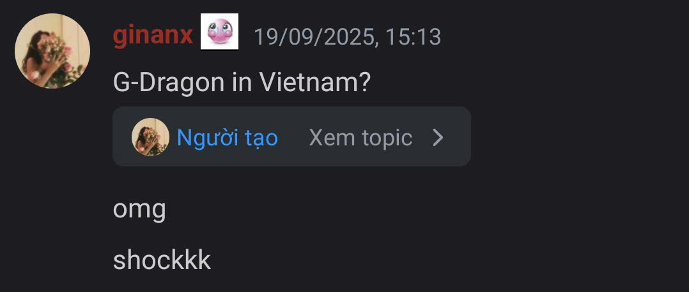
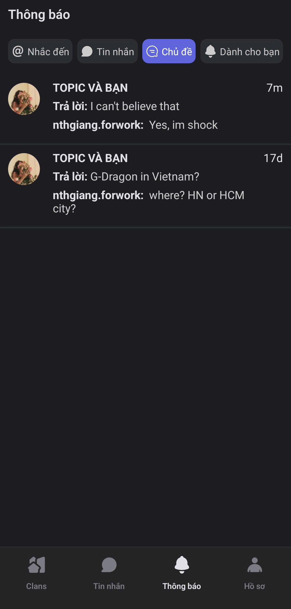

# Thảo luận ngắn

### Cách tạo Thảo luạn ngắn trong đoạn chat



Trong **Kênh Văn bản** hoặc **Chủ đề**, nhấn giữ vào tin nhắn mà bạn muốn thảo luận thêm.&#x20;



Chọn **Thảo luận chủ đề**

<figure><figcaption></figcaption></figure>




Nhập tin nhắn trong **cửa sổ Thảo luận ngắn** để bắt đầu trao đổi

<figure><figcaption></figcaption></figure>




Cách xem lại **Thảo luận ngắn** đã thảo luận

Bạn có thể dễ dàng xem lại các chủ đề đã tham gia trong Clan:

* Ngay trong khung trò chuyện, **nhấn “Xem Topic”** để mở lại nội dung và toàn bộ cuộc thảo luận liên quan.

<figure><figcaption></figcaption></figure>

* Hoặc truy cập **phần Thông báo → Chủ đề**, nơi hiển thị **toàn bộ các topic** mà bạn đã tham gia hoặc theo dõi trong Clan.

<figure><figcaption></figcaption></figure>





Với **Thảo luận ngắn**, bạn vừa giữ được cuộc trò chuyện chính tập trung, vừa mở rộng thảo luận chi tiết mà không sợ bị lẫn lộn.

