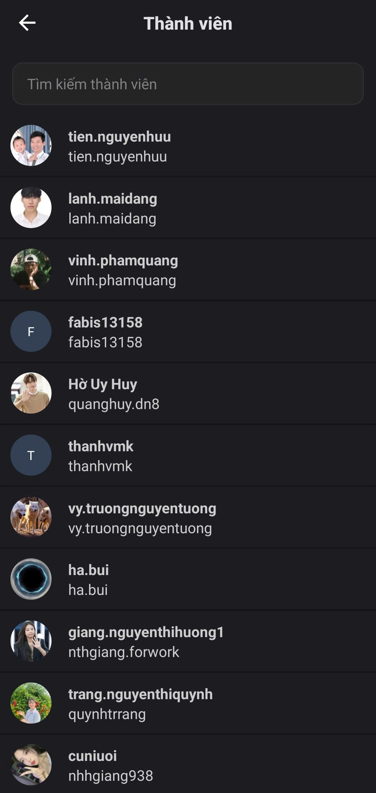

# Quản lý thành viên

Trong **Cài đặt Clan** bạn có thể truy cập **Quản lý thành viên**.

<figure><figcaption></figcaption></figure>

Tại đây, bạn có thể xem toàn bộ danh sách thành viên của Clan.

Sử dụng thanh **tìm kiếm** để nhanh chóng tìm một người cụ thể.

Khi nhấn vào tên thành viên, bạn có thể:

* Chỉnh sửa vai trò của họ
* Chuyển quyền sở hữu Clan
* Khai trừ thành viên ra khỏi Clan khi cần thiết
