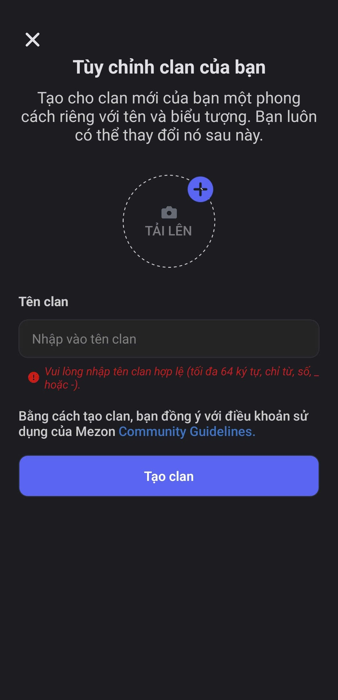

# Tạo Clan

### Các bước tạo Clan



Nhấn vào biểu tượng "**+"**   trên thanh dọc bên trái màn hình.



**Đặt tên Clan** (tối đa 64 ký tự, chỉ dùng chữ cái, số, \_ hoặc -)

<figure><figcaption></figcaption></figure>




**Tải lên ảnh đại diện** cho Clan.


Đừng lo nếu tên chưa kêu, ảnh chưa đẹp, bạn có thể thay đổi ảnh đại diện sau.




Nhấn vào "**Tạo Clan**" để tạo Clan.


