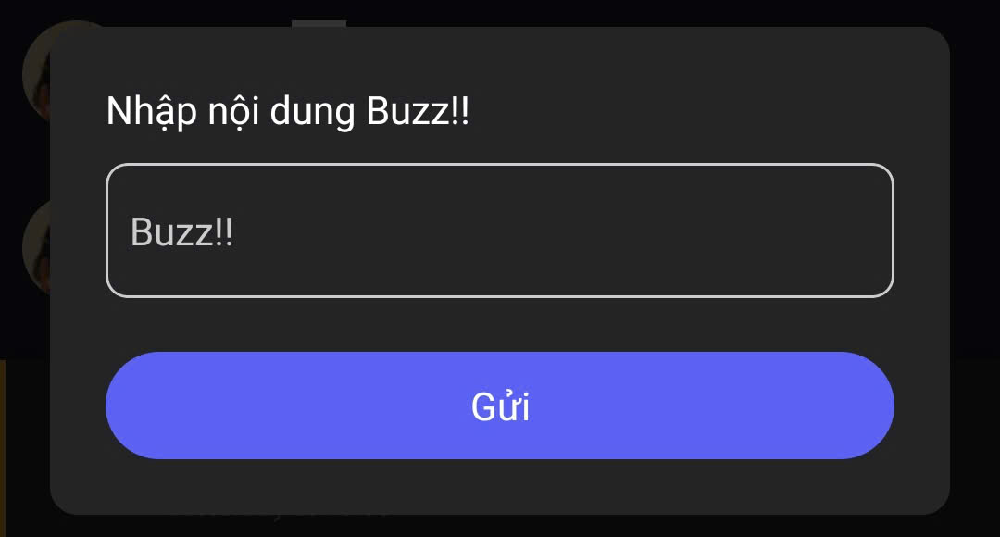
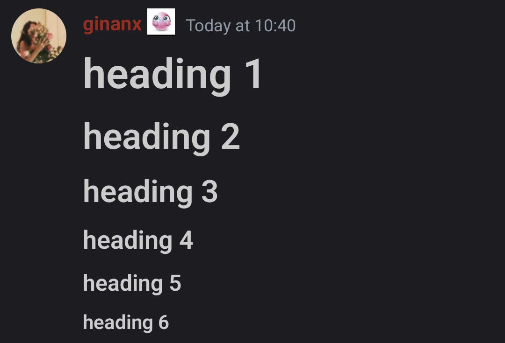
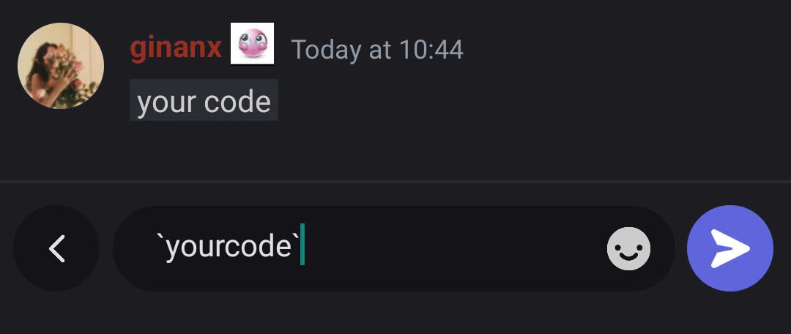
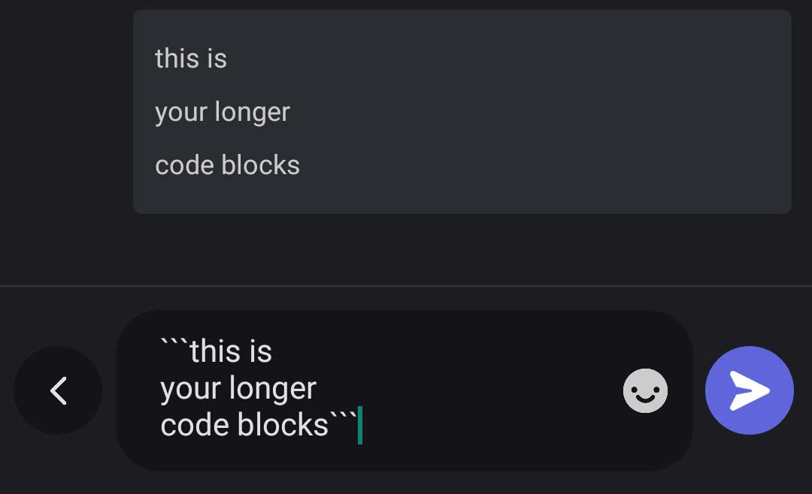

# Phím tắt

Trong kênh văn bản hoặc chủ đề, bạn có thể bật **ẩn danh** hoặc sử dụng **Buzz** để tạo cách trò chuyện linh hoạt và thu hút hơn.

### **Chế độ Ẩn danh**

Tính năng **Ẩn danh** cho phép bạn gửi tin nhắn mà không hiển thị tên người dùng, giúp chia sẻ ý kiến hoặc góp ý một cách khách quan.

#### **Cách bật ẩn danh**



Nhấn vào **kênh** hoặc **chủ đề** bạn muốn nhắn tin.



Chọn biểu tượng **ba chấm** ở góc trên cùng bên trái

<figure><figcaption></figcaption></figure>




Chọn **Bật ẩn danh** để bắt đầu gửi tin nhắn ẩn danh

<figure><figcaption></figcaption></figure>





Khi bật, trong khung nhập tin nhắn sẽ xuất hiện **biểu tượng chiếc mũ**, cho biết bạn đang ở **chế độ ẩn danh**.

.png>)


#### **Cách tắt ẩn danh**

Nhấn lại vào biểu tượng **ba chấm**, chọn **Tắt ẩn danh** để trở về chế độ bình thường.

<figure><figcaption></figcaption></figure>

### **Chế độ Buzz**

Tính năng **Buzz** giúp bạn gửi tin nhắn kèm hiệu ứng âm thanh để **thu hút sự chú ý** của tất cả mọi người trong kênh.

#### **Cách gửi Buzz**



Trong **kênh** hoặc **chủ đề**, nhập nội dung tin nhắn bạn muốn gửi.



Bật **Buzz** bằng cách chọn biểu tượng **ba chấm**, rồi gửi tin nhắn.

<figure><figcaption></figcaption></figure>

<figure><figcaption></figcaption></figure>




Khi tin nhắn được gửi, mọi người trong kênh sẽ nhận được thông báo âm thanh Buzz.

<figure><figcaption></figcaption></figure>





Chế độ ẩn danh hữu ích trong các chủ đề thảo luận nhạy cảm, trong khi Buzz thích hợp để nhấn mạnh thông báo quan trọng hoặc kêu gọi phản hồi nhanh.


***

### Định dạng tin nhắn

#### **Chữ lớn**

Làm nổi bật các tin nhắn quan trọng – Gõ **#** rồi thêm một khoảng trắng để tạo chữ lớn trong khung chat.


Dùng **#** đến **#####** để tạo các cấp độ tiêu đề từ 1 đến 5.


<figure><figcaption></figcaption></figure>

#### **Khối mã**

Ví dụ: **\`văn bản của bạn\`** – Dùng **một dấu huyền ngược** (\`) để làm nổi bật đoạn văn bản ngắn trong dòng.

<figure><figcaption></figcaption></figure>


Dùng **ba dấu huyền ngược** (\`\`\`) để tạo **khối mã nhiều dòng**, thích hợp cho các đoạn mã dài hơn.


